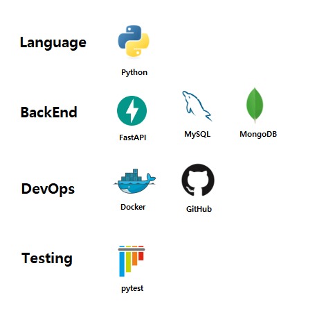

# FastAPI Q&A 서비스

FastAPI 기반의 Q&A(질문-답변) 서비스로, '점프 투 FastAPI' 도서 내용을 토대로 개발되었으며, 사용자들이 질문을 작성하고 답변을 달 수 있는 게시판 커뮤니티 API 입니다. RESTful API를 통해 질문과 답변 관리를 지원하며, 모듈화된 구조로 쉽게 확장이 가능합니다.


## 🚀 프로젝트 개요

커뮤니티 기반 Q&A 서비스를 구현합니다. 주요 특징으로는:
- FastAPI 기반의 고성능 비동기 API 서버
- RESTful API를 통한 질문 및 답변 관리
- OAuth2 Password Bearer 흐름에서 JWT를 활용한 사용자 인증 및 권한 관리
- 모듈화된 아키텍처로 유지보수성 향상
- 자동화된 테스트 시스템 (Unit & Feature 테스트)


## 🛠️ 기술 스택



### 개발 도구
- 테스트: pytest, pytest-asyncio
- 문서화: Swagger UI, ReDoc (FastAPI 기본 제공)


## 🏗️ 프로젝트 구조

```text
fastapi-qna/
├── app/                         # 애플리케이션 코드
│   ├── api/                     # API 라우터
│   │   └── v1/                  # API 버전 1
│   │       └── pybo/            # Q&A 관련 엔드포인트
│   │           ├── answer/      # 답변 관련 라우터
│   │           ├── question/    # 질문 관련 라우터
│   │           └── user/        # 사용자 관련 라우터
│   │
│   ├── domain/                  # 도메인 로직
│   │   └── pybo/                # Q&A 도메인 로직
│   │       ├── answer/          # 답변 관련 도메인 로직
│   │       │   ├── dependencies/  # 의존성 주입
│   │       │   ├── models/       # 답변 모델
│   │       │   ├── repositories/ # 데이터 접근 계층
│   │       │   ├── schemas/      # Pydantic 모델 (요청/응답 스키마)
│   │       │   └── services/     # 답변 비즈니스 로직
│   │       │
│   │       ├── question/        # 질문 관련 도메인 로직
│   │       │   ├── dependencies/  # 의존성 주입
│   │       │   ├── models/       # 질문 모델
│   │       │   ├── repositories/ # 데이터 접근 계층
│   │       │   ├── schemas/      # Pydantic 모델 (요청/응답 스키마)
│   │       │   └── services/     # 질문 비즈니스 로직
│   │       │
│   │       ├── user/            # 사용자 관련 도메인 로직
│   │       │   ├── models/       # 사용자 모델
│   │       │   ├── schemas/      # Pydantic 모델 (요청/응답 스키마)
│   │       │   └── services/     # 사용자 관련 비즈니스 로직
│   │       │
│   │       ├── auth/            # 인증 관련 도메인 로직
│   │       │   ├── dependencies/  # 의존성 주입
│   │       │   ├── schemas/      # 인증 관련 스키마
│   │       │   └── services/     # 인증 관련 비즈니스 로직
│   │       │
│   │       └── associations/     # 다대다 관계 모듈
│   │           ├── user_question.py  # 사용자-질문 추천 관계
│   │           └── user_answer.py    # 사용자-답변 추천 관계
│   │
│   └── common/                  # 공통 유틸리티
│       ├── constants/           # 상수 정의
│       │   ├── app.py          # 애플리케이션 상수
│       │   ├── auth.py         # 인증 관련 상수
│       │   └── database.py     # 데이터베이스 관련 상수
│       │
│       ├── exceptions/          # 예외 처리
│       │   └── handlers.py      # 예외 핸들러
│       │
│       ├── helpers/             # 도우미 함수
│       │   ├── database.py      # 데이터베이스 헬퍼
│       │   └── security.py      # 보안 관련 헬퍼
│       │
│       └── utils/               # 유틸리티 함수
│           ├── auth.py          # 인증 유틸리티
│           ├── datetime.py      # 날짜/시간 유틸리티
│           ├── file.py          # 파일 처리 유틸리티
│           └── response.py      # 응답 포맷 유틸리티
│
├── config/                     # 설정 파일
│   ├── __pycache__/
│   └── settings.py             # 애플리케이션 설정
│
├── migrations/                  # 데이터베이스 마이그레이션
├── tests/                       # 테스트 코드
│   ├── conftest.py              # 테스트 픽스처
│   ├── test_question_api.py     # 질문 API 테스트
│   └── test_answer_api.py       # 답변 API 테스트
│
├── main.py                      # 애플리케이션 진입점
├── alembic.ini                  # Alembic 설정
└── requirements.txt             # 의존성 목록
```

## ✨ 기능 목록

- [x] 사용자 관리 (회원가입, 로그인)
- [x] 질문 CRUD 기능
- [x] 답변 CRUD 기능
- [x] 질문, 답변 추천 기능
- [x] OAuth 2.0 Password Bearer 흐름에서 JWT를 활용한 인증
- [x] 데이터베이스 마이그레이션
- [x] API 문서화